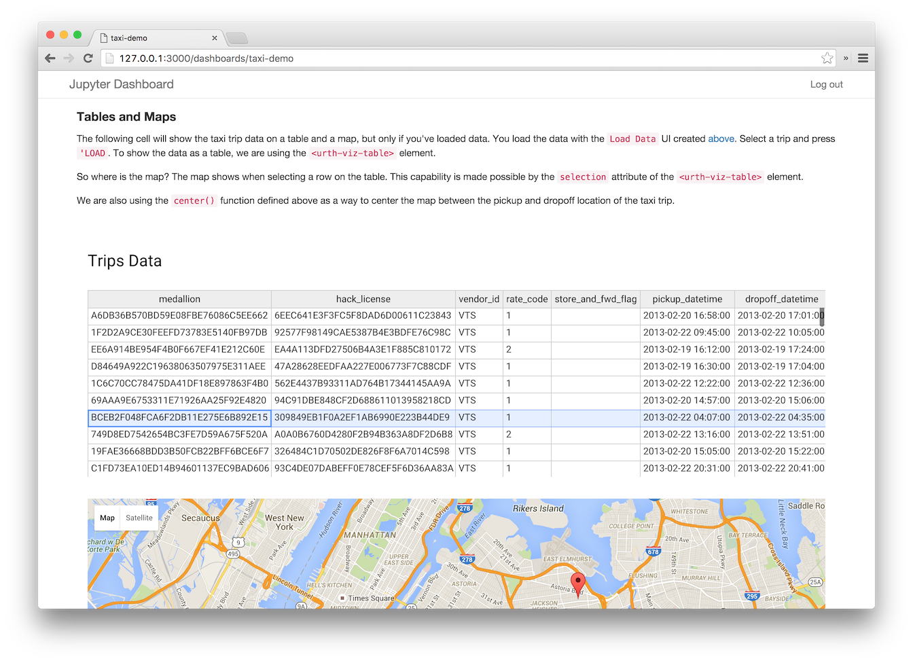

[](https://travis-ci.org/jupyter-incubator/dashboards_server) [](https://groups.google.com/forum/#!forum/jupyter)

# Jupyter Dashboards Server

A NodeJS application that can display Jupyter notebooks as dynamic dashboards outside of the Jupyter Notebook server.



This repository is a portion of the `jupyter-incubator/dashboards` effort which covers:

* [Arranging](https://github.com/jupyter-incubator/dashboards) notebook outputs in a grid-layout
* [Bundling](https://github.com/jupyter-incubator/dashboards_bundlers) notebooks and associated assets for deployment as dashboards
* [Serving](https://github.com/jupyter-incubator/dashboards_server) notebook-defined dashboards as standalone web apps (**this repo**)

It is also has close ties to [jupyter-incubator/declarativewidgets](https://github.com/jupyter-incubator/declarativewidgets) which provides one way (but not the only way) of enabling rich interactivity in notebook-defined dashboards.

## What it Gives You

* Ability to run a Jupyter Notebook with [layout metadata](https://github.com/jupyter-incubator/dashboards) as a standalone dashboard application
* Ability to navigate a list of multiple notebooks and select one to run as a dashboards
* Optional shared login to secure access to the dashboard server
* API for POSTing notebooks to the server at runtime with optional authentication (`/_api/notebooks`)

The behavior of the application is similar to that of [Thebe](https://github.com/oreillymedia/thebe), but with some key technical differences:

* The notebook code is visible only in the NodeJS application backend.
* The NodeJS backend is the only actor that can send notebook code to a kernel for execution.
* The browser client can only send [Jupyter comm messages](http://jupyter-client.readthedocs.org/en/latest/messaging.html#opening-a-comm) to kernels (*not* arbitrary code).
* The application uses the [jupyter-js-services](https://github.com/jupyter/jupyter-js-services) and [jupyter-js-widgets](https://github.com/ipython/ipywidgets/tree/master/jupyter-js-widgets) libraries for communication with kernels.

## Detailed Documentation

* [Server API](https://github.com/jupyter-incubator/dashboards_server/wiki/Server-API) - server endpoints
    - Also contains information about **bundled dashboards** (allowing specification of external resources).

## Try It

We have not yet made a standalone release of this project (e.g., on npm). If you want to try it today, you can run the demos here in Docker. A simple way to run [Docker](https://www.docker.com/) is to use [docker-machine](https://docs.docker.com/machine/get-started/). After setting up Docker, do the following:

```
make build
make demo-container
```

Open your web browser and point it to the dashboards server running on your Docker host at `http://<docker host ip>:3000/`.

To see another notebook as a dashboard:

1. Create a dashboard layout in Jupyter Notebook using the `jupyter_dashboards` extension.
2. Copy the `*.ipynb` file to the `data/` directory in the project root.
3. Run `make demo-container` again -- this will rebuild the Docker image and restart the Node application container.

**Note** that this project is a work in progress and so many notebooks with dashboard layouts and interactive widgets will not work here yet.

## Deploy It

A minimal deployment of the dashboards server has the following components:


For more details, including use cases and alternative deployments, see the [dashboards deployment roadmap](https://github.com/jupyter-incubator/dashboards/wiki/Deployment-Roadmap).

## Develop It

You can use the Try It setup above for development, but any change you make to the source will require a restart of the dashboard server container. A better approach is to install the following on your host machine:

* Node 5.5.0
* npm 3.5.3
* gulp 3.9.0
* Docker 1.9.1
* Docker Machine 0.5.6

With these installed, you can use the `make dev-*` targets. Under the covers, these targets use `gulp` to automatically rebuild and restart the dashboard server any time you make a code change. Run `make help` to see the full gamut of targets and options. See the next few sections for the most common patterns. Of course, you can mix and match.

### Setup

```bash
# re-run if the Dockerfile.kernel changes
make kernel-gateway-image
# re-run if package.json or bower.json changes
make dev-install
# run if you want to try the preliminary jupyter-incubator/declarativewidgets support
make examples
```

### Dashboard Server w/ Auto Restart

```bash
make dev
# mac shortcut for visiting URL in a browser
open http://127.0.0.1:3000
```

### Dashboard Server w/ Auto Restart and Debug Console Logging

```bash
make dev-logging
# mac shortcut for visiting URL in a browser
open http://127.0.0.1:3000
```

### Dashboard Server w/ Auto Restart and Remote Debugging

```bash
npm install -g node-inspector
make dev-debug
# a browser tab should open with the debugger visible
# refresh if it errors: the server might not be running yet
```

### Dashboard Server w/ Auto Restart and Form Auth

```bash
make dev USERNAME=admin PASSWORD=password
# mac shortcut for visiting URL in a browser
open http://127.0.0.1:3000
```

See the [Authentication](https://github.com/jupyter-incubator/dashboards_server/wiki/Authentication) wiki page for information about configuring alternative authentication mechanisms.

### Dashboard Server w/ Auto Restart and Self-Signed HTTPS Certificate

```bash
make certs
make dev HTTPS_KEY_FILE=certs/server.pem HTTPS_CERT_FILE=certs/server.pem
# mac shortcut for visiting URL in a browser
open https://127.0.0.1:3001
```

### Dashboard Server Tests

```bash
# unit tests
make test
# backend integration tests
make integration-test
```
