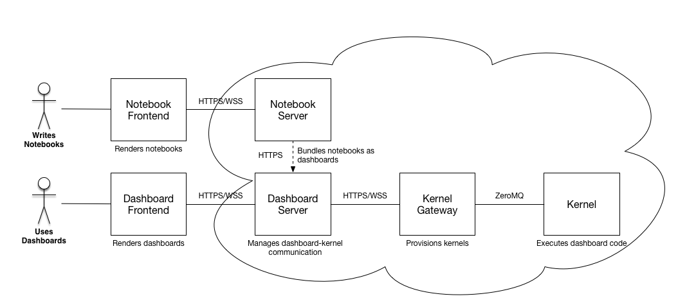

[](https://travis-ci.org/jupyter-incubator/dashboards_nodejs_app) [](https://groups.google.com/forum/#!forum/jupyter)

# Jupyter Dashboards Server

This repo contains a NodeJS application that can display Jupyter notebooks as dynamic dashboards outside of the Jupyter Notebook server. The behavior of the application is similar to that of [Thebe](https://github.com/oreillymedia/thebe), but with some key technical differences:

* The notebook code is visible only in the NodeJS application backend.
* The NodeJS backend is the only actor that can send notebook code to a kernel for execution.
* The browser client can only send [Jupyter comm messages](http://jupyter-client.readthedocs.org/en/latest/messaging.html#opening-a-comm) to kernels (*not* arbitrary code).
* The application uses the jupyter-js-services and jupyter-js-widgets libraries for communication with kernels.

**Note** that this project is very much a work-in-progress as part of the [dashboards deployment roadmap](https://github.com/jupyter-incubator/dashboards/wiki/Deployment-Roadmap).

## Run It

For the moment, see the *Develop It* section. We'll provide more detail here once we make a stable release on how to run the server outside a development environment.

In the meantime, if you want to get a sense of all the configuration options, run `make help`.

## Deploy It

A minimal deployment of the dashboards server has the following components:



For more details, including use cases and alternative deployments, see the [dashboards deployment roadmap](https://github.com/jupyter-incubator/dashboards/wiki/Deployment-Roadmap).

## Develop It

Running the Node application requires Docker. A simple way to run [Docker](https://www.docker.com/) is to use [docker-machine](https://docs.docker.com/machine/get-started/).

You can run the Node application with your choice of backend kernel provider.

### Run Node app with kernel gateway

To run the Node application container and a single kernel gateway container:

```bash
make run
```

### Run Node app with tmpnb notebook service

To run the Node application container and the [tmpnb](https://github.com/jupyter/tmpnb) notebook service, which includes a configurable HTTP proxy container, an orchestration server container, and a pool of kernel gateway containers:

```bash
make run-tmpnb
```

### Access Node app

Once the Node application and backend containers are running, visit `http://<external docker IP>:3000/notebooks/simple` to see a simple example notebook as a dashboard.

To see another notebook as a dashboard:

1. Copy the `*.ipynb` file to the `data/` directory in the project root.
2. Run `make run` (or `make run-tmpnb`) again -- this will rebuild the Docker image and restart the Node application container.

### Options

The Node application container runs with minimal HTTP logging by default.  To run the Node application with debug-level logging enabled:

1. `make run-logging`
2. Logs will print to the server console.

To run the Node application with remote debugging enabled:

1. `make run-debug`
2. Open `http://<external docker IP>:9711/?ws=<external docker IP>:9711&port=5858` to access the `node-inspector` and commence debugging.

To run the Node application with a self-signed certificate, first create the certificate, then run one of the above commands while setting **both** the `HTTPS_KEY_FILE` and `HTTPS_CERT_FILE` environment variables:

1. `make certs`
2. `make run HTTPS_KEY_FILE=certs/server.pem HTTPS_CERT_FILE=certs/server.pem`
3. Visit `http://<external docker IP>:3001/notebooks/simple` to see a simple example notebook as a dashboard.

### tmpnb options

The `TMPNB_PROXY_AUTH_TOKEN` environment variable sets the value of a token that the tmpnb proxy and orchestration containers use to authenticate requests between them.  To run tmpnb with a unique token:

```bash
make run-tmpnb \
  TMPNB_PROXY_AUTH_TOKEN="$(openssl rand -base64 32)"
```

To run tmpnb with a pool of 5 kernel gateway containers, each with a memory limit of 1GB:

```bash
make run-tmpnb \
  POOL_SIZE=5 \
  MEMORY_LIMIT=1G
```

To stop all tmpnb containers:

```bash
make kill-tmpnb
```
